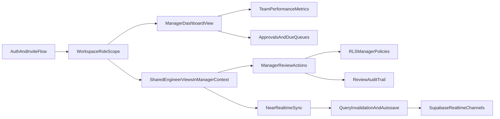
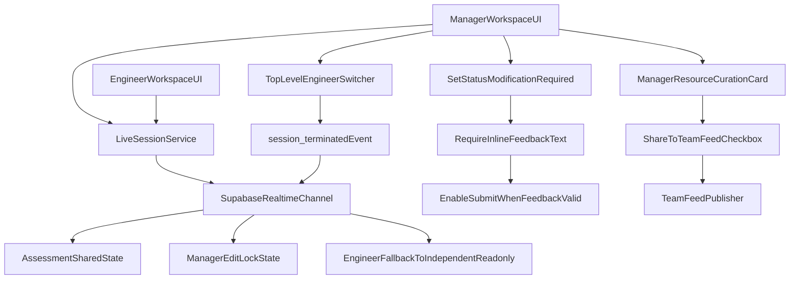

# Manager Dashboard Feasibility and Delivery Plan

## Feasibility Verdict

All requested capabilities are feasible with the current stack (TanStack + Supabase), with different effort levels:

- **Feasible now with light changes (Phase 1):** separate manager landing experience, team roster, pending approvals/review queues, promotion visibility, 360 give/receive, manager profile-only settings, hide engineer-only settings in manager mode.
- **Feasible with moderate backend/RLS work (Phase 2):** manager review actions directly on engineer artifacts (approve/request changes, manager notes, evidence review status, assessment manager notes), objective approval pipeline.
- **Feasible with moderate realtime work (Phase 3):** near real-time co-view (selected by user) using Supabase Realtime invalidation + autosave + optimistic concurrency checks.
- **Feasible but should be deferred/not required for MVP:** full Google-Sheets parity (presence cursors + cell-level conflict-free simultaneous editing), because near real-time already meets the selected goal.

## Requirement-by-Requirement Mapping

- **Distinct manager dashboard (not same as engineer):** feasible; implement manager-specific dashboard shell section in existing `HomeRouteApp` with manager KPI cards + team graph + queues.
- **Engineer-link onboarding & auto-association:** mostly present; needs hardening (OAuth/deeplink consistency, post-redeem routing to manager dashboard, consistent invite state handling).
- **Manager can see all engineers under them:** already partially present; formalize manager roster page and team graph widget.
- **Manager visibility into evidence/objectives/readiness/reports:** mostly present in read-only form; complete by fixing RLS parity for objectives/assessments/report resources.
- **Manager review notes/comments/status actions:** partially present in UI and schema; needs explicit manager-scoped mutation paths + policies.
- **Pending approvals / review requests / due dates:** feasible; aggregate from objectives/evidence/assessment tables into manager inbox feed.
- **Near real-time sync (chosen scope):** feasible; add Realtime subscriptions + query invalidation + optimistic locking for edited sections.
- **Lagging engineers / capacity at-a-glance:** feasible; define computable metrics and render in manager dashboard.
- **Generate business case for promotion:** already partly present via `business_cases`; add manager dashboard entry points and stronger workflow states.
- **Curate/share resources:** already partly present (`manager_resources`); unify with report resources and sharing surfaces.
- **Manager can log knowledge but not evidence:** feasible; enforce by UI gating + mutation guards in manager mode.
- **Manager ↔ engineer mode toggle (manager accounts only):** partially present via workspace switching; formalize explicit mode toggle and role detection.
- **Manager mode hides invite link / notifications / extension prefs / competency framework:** feasible via mode-scoped settings and nav filtering.
- **360 feedback give/receive for managers:** already supported; ensure manager dashboard includes feedback inbox/outbox summary.

## What Should Not Be Included Now

- **Full collaborative editing engine (OT/CRDT) for assessments:** unnecessary for selected near real-time scope.
- **Duplicate manager-only copies of engineer pages:** unnecessary; reuse current pages with manager-scoped permissions/actions to preserve UX consistency.
- **Using `account_roles` as sole truth immediately:** risky because current production behavior relies on `reporting_relationships`; phase it in after compatibility bridge.

## Suggested Missing Items to Add

- **Audit trail & attribution:** add `last_edited_by`, `last_edited_at`, and review action history for manager interventions.
- **Escalation & SLA indicators:** overdue approvals/reviews and due-soon assessments for manager prioritization.
- **Manager digest notifications:** daily/weekly summary for pending actions and lagging engineers.
- **Data privacy guardrails for 360 feedback:** explicitly define what managers can see pre-threshold vs post-threshold.
- **Manager-specific onboarding checklist:** first-time manager empty states, guidance, and relationship status hints.

## Peer Review Critical Interlocks (Required)

- **Cross-session switcher interlock (real-time safety gate):** when manager switches from Engineer A to Engineer B during a live sync session, emit `session_terminated` for Engineer A and return engineer UI to independent read-only mode.
- **Mandated request-modification text interlock:** when manager selects `Modification Required`, keep submit action disabled until inline feedback text is non-empty and valid.
- **Manager knowledge sharing gateway:** in manager resource curation card, add quick-action `Share to Team Feed` checkbox to publish selected resources to team feed while preserving manager personal playbook.
- **Option alignment:** retain Option A (`Personal Notepad Repository`) and enforce Option B (`Manager Edit-Lock`) for synchronized calibration sessions.

## Delivery Architecture (Target)

## Redesigned Real-Time Assessment Framework

## Implementation Phases

### Phase 0: Contract and Metrics Definition

- Define lagging/capacity formulas and promotion-readiness rollups.
- Define manager review-only write contract (approved in user choices).
- Define visibility matrix for manager mode vs engineer mode.

### Phase 1: Manager Experience Separation (UI + Routing)

- Add manager-specific dashboard composition in:
  - `[/Users/courage/dev/cloud-truss/evitrace/src/features/home/shell/home-route-app.tsx](/Users/courage/dev/cloud-truss/evitrace/src/features/home/shell/home-route-app.tsx)`
  - `[/Users/courage/dev/cloud-truss/evitrace/src/features/home/shell/home-shell.tsx](/Users/courage/dev/cloud-truss/evitrace/src/features/home/shell/home-shell.tsx)`
- Formalize manager-only mode toggle for users with managed engineers.
- Hide engineer-only settings/features in manager mode unless toggled to engineer mode.

### Phase 2: Manager Review Actions (Backend + Frontend)

- Add/adjust manager-scoped APIs and hooks under:
  - `[/Users/courage/dev/cloud-truss/evitrace/src/lib/api/objectives.ts](/Users/courage/dev/cloud-truss/evitrace/src/lib/api/objectives.ts)`
  - `[/Users/courage/dev/cloud-truss/evitrace/src/lib/api/evidence.ts](/Users/courage/dev/cloud-truss/evitrace/src/lib/api/evidence.ts)`
  - `[/Users/courage/dev/cloud-truss/evitrace/src/lib/api/assessments.ts](/Users/courage/dev/cloud-truss/evitrace/src/lib/api/assessments.ts)`
- Wire manager actions in existing overlays/panels:
  - `[/Users/courage/dev/cloud-truss/evitrace/src/features/home/shell/home-evidence-overlays.tsx](/Users/courage/dev/cloud-truss/evitrace/src/features/home/shell/home-evidence-overlays.tsx)`
  - `[/Users/courage/dev/cloud-truss/evitrace/src/features/home/shell/home-objective-overlays.tsx](/Users/courage/dev/cloud-truss/evitrace/src/features/home/shell/home-objective-overlays.tsx)`
  - `[/Users/courage/dev/cloud-truss/evitrace/src/components/ManagerActionsPanel.tsx](/Users/courage/dev/cloud-truss/evitrace/src/components/ManagerActionsPanel.tsx)`
- Add SQL migrations for RLS parity and constrained manager write policies:
  - `[/Users/courage/dev/cloud-truss/evitrace/supabase/migrations](/Users/courage/dev/cloud-truss/evitrace/supabase/migrations)`
- Enforce request-modification text interlock in objective review components:
  - disable status submit on `Modification Required` until manager feedback is present
  - add validation + error state copy aligned with Atlassian form patterns
- Add resource sharing gateway in manager curation workflow:
  - `Share to Team Feed` checkbox and publish action separation from personal save

### Phase 3: Near Real-Time Sync

- Add realtime subscription hooks and query invalidation strategy.
- Add optimistic concurrency/version checks for manager-review writable entities.
- Scope realtime initially to evidence review, objective approval states, and manager comments.
- Add cross-session switcher interlock:
  - persist active sync session identity per manager-engineer pair
  - emit `session_terminated` when manager switches engineer context
  - force engineer-side fallback to independent read-only state
- Enforce Manager Edit-Lock during synchronized calibration:
  - manager is active editor for locked assessment fields
  - engineer can observe updates in near real-time and continue outside lock scope only when unlocked

### Phase 4: Onboarding Hardening

- Stabilize invite/deep-link flow for manager first-use and already-signed-in cases:
  - `[/Users/courage/dev/cloud-truss/evitrace/src/routes/invite.tsx](/Users/courage/dev/cloud-truss/evitrace/src/routes/invite.tsx)`
  - `[/Users/courage/dev/cloud-truss/evitrace/src/features/home/auth/auth.tsx](/Users/courage/dev/cloud-truss/evitrace/src/features/home/auth/auth.tsx)`
  - `[/Users/courage/dev/cloud-truss/evitrace/src/lib/api/manager-invites.functions.ts](/Users/courage/dev/cloud-truss/evitrace/src/lib/api/manager-invites.functions.ts)`
- Ensure post-redeem redirect lands manager on manager dashboard with linked engineer visible.

### Phase 5: Validation and Rollout

- Add integration tests for role switching, manager review permissions, and invite flows.
- Add realtime behavior tests (cross-session update visibility).
- Ship behind feature flags for controlled rollout.

## Risks and Mitigations

- **RLS complexity risk:** mitigate with migration-by-domain and policy test fixtures.
- **Role model drift (`account_roles` vs relationships):** keep `reporting_relationships` as source-of-truth for access in first rollout.
- **Realtime race conditions:** start with invalidation-based near real-time before fine-grained patch merging.
- **UX overload for managers:** progressive disclosure (top-level queues first, deep drill-down second).

## Acceptance Criteria Snapshot

- Manager dashboard is visually and functionally distinct from engineer dashboard.
- Manager can review/approve/request changes and leave notes in allowed review surfaces.
- Manager sees team health, lagging engineers, readiness indicators, and pending actions at a glance.
- Manager and engineer observe updates near real-time in shared review surfaces.
- Manager mode hides engineer-only settings/features unless toggled to engineer mode.
- 360 feedback give/receive remains operational in manager mode.
- When manager switches from Engineer A to Engineer B during live sync, Engineer A receives `session_terminated` and assessment view exits synchronized state safely.
- Manager cannot submit `Modification Required` without feedback text; UI clearly communicates required field.
- Manager can save resources privately and optionally publish to team feed via `Share to Team Feed` checkbox in the same curation flow.

